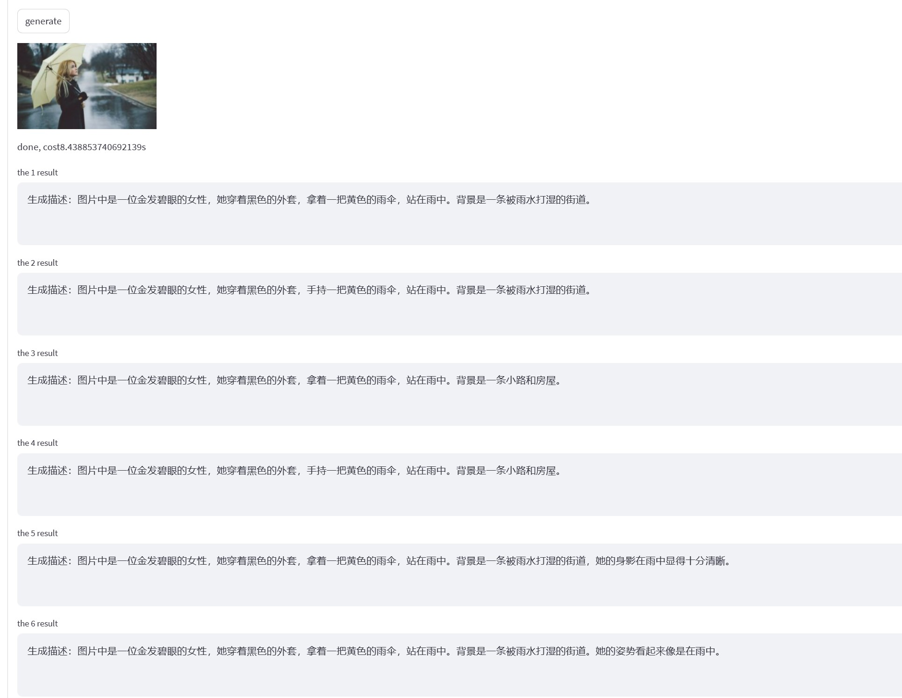
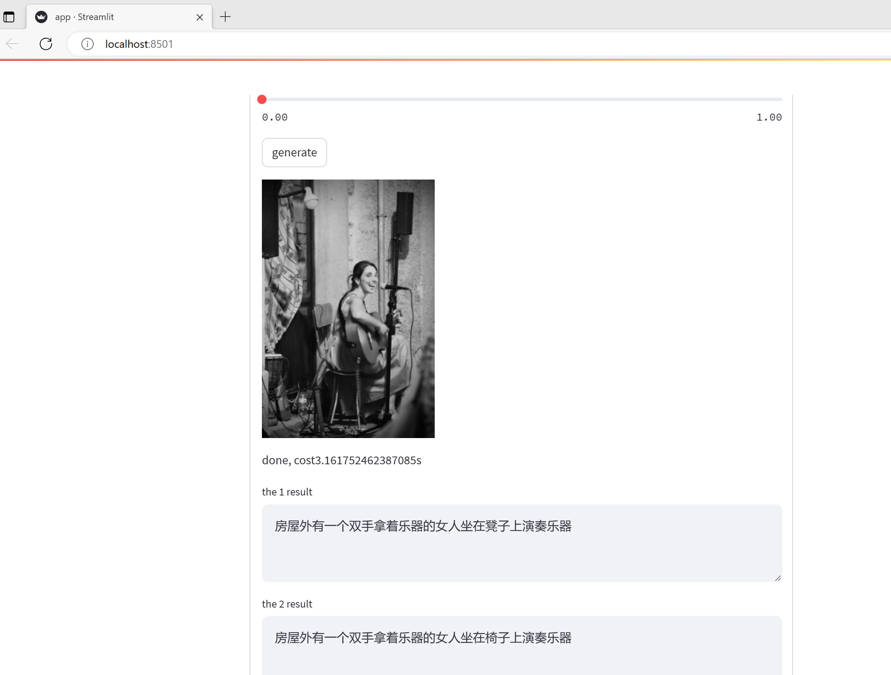
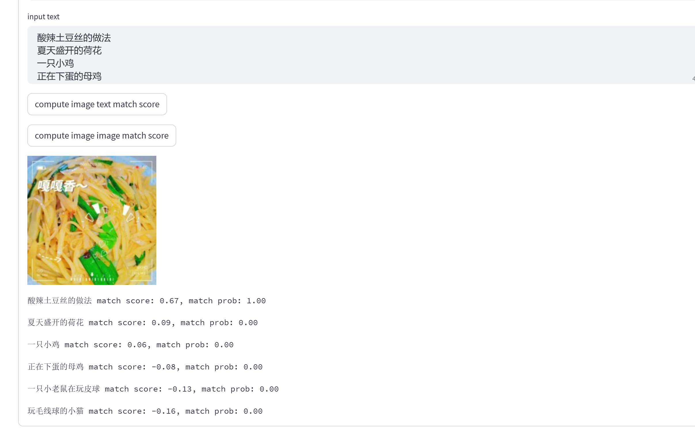
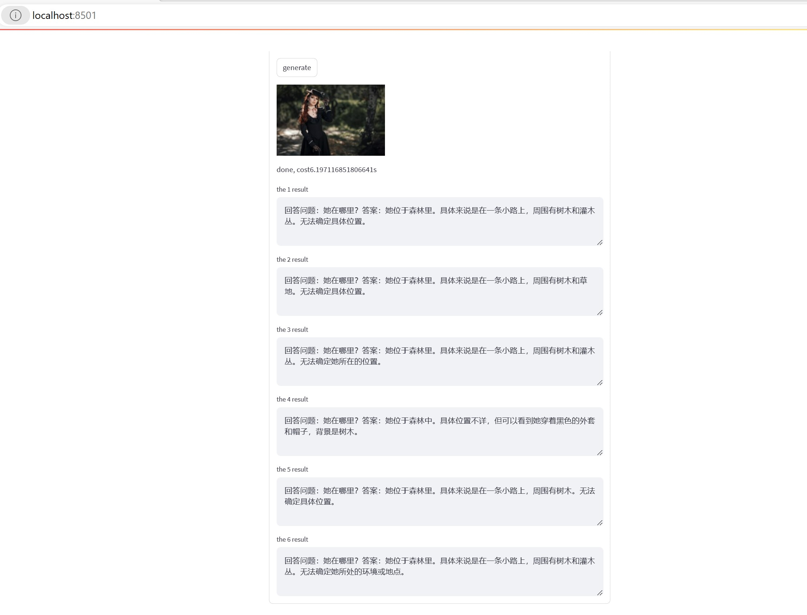
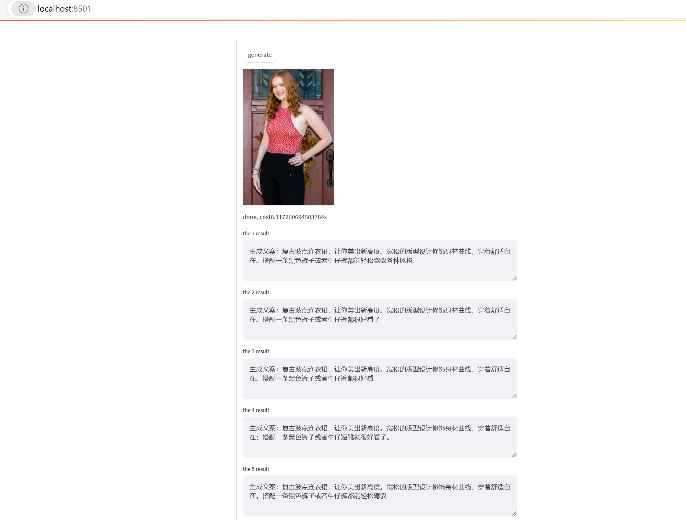
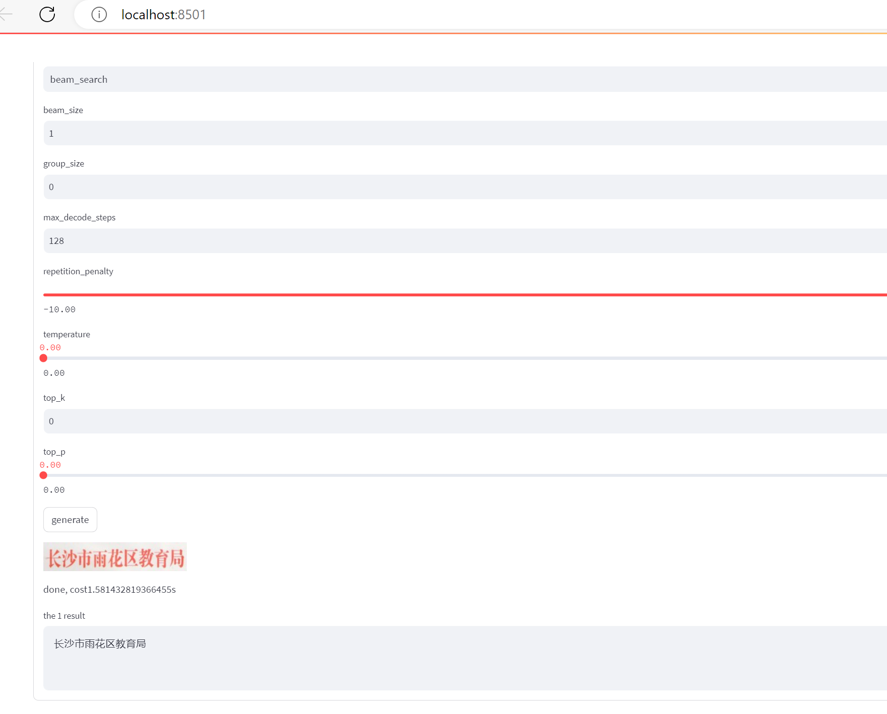

# Mimix: A Tool for Seq2seq learning framework based on Pytorch 

Mimix is a tool for Seq2seq learning framework based on Pytorch. Basically, I implement several generative models, including rnn-seq2seq and transformer. Some other models, such as Text CNN, Transformer-based classifier and Transformer-based Language model, are also provided. To facilitate the use of pretrained models, Mimix can also load bert model weights. Other pretrained models may be supported in the future.

I have trained some Chinese Generative Models which are listed in Demo section. You can follow the instructions and run the demo.  ~~**An application is required for model download.**~~ Now you can download the weights directly without sending me an email. **You must follow the agreement to use the model. Please scan the completed [agreement](https://github.com/yaoxiaoyuan/mimix/blob/main/agreement/Mimix%20Model%20Release%20Agreement.docx).** 

**UPDATE 2023.08**:  

1. The entire project's code has been refactored. Now it is easier to use. 

2. **The old model weights and config files are not compatible with new code. Please download new model data. Old weights links may become invalid in the future.**

3. I added some example code and config files for training. The training code is flexible and can be easily modified. If use training code, it is better to read the model kwargs in code. Documentation may be improved in the future. 

4. Now MIMIX support image classification,  Image caption/image vqa and image-text match task. I have trained image classification model on ChineseFoodNet dataset. By using the pretrained VIT model, it can easily beats the single resnet152 model (VIT get top1 acc 0.7967 on test data set, ResNet152 get top1 acc 0.7900 on test data set) .  

5. Although LLM achieve remarkable performance in recent years, this project focus on training model useful but not that large(less than 1.5B).  Training LLM cost too much for individuals. Also, there already exists many projects for finetune large LLM  at low cost. However, I may boost Chinese text generation models trained before by leveraging the new LLM model.  New models may be released in the future.

6. RNN-seq2seq code has been removed in new code. You can still check the code on branch v1. But it won't be maintained.


If you want to contact with me, please send me an email.

### Cite

```
@misc{mimix,
  title={mimix},
  author={Xiaoyuan Yao},
  year={2021}
}
```

## Models

Several pretrained models are listed below.  ~~**Some models are not available for download due to the data privacy. Please check the "open for download" column. You can follow the instructions to use the open-download model.**~~

| model name                           | architecture                    | n_params  | n_layers | d_model | n_heads | n_samples | data size | open for download |
| ------------------------------------ | ---- | ---- | :--- | ---- | ---- | ------------------------------------ | ------------------------------------ | ------------------------------------ |
| Chinese chitchat generation small/base | transformer enc-dec | 100m/216m | 12 | 512/768 | 8/12 | 400m | 76GB | True |
| Chinese shi,ci,duilian generation small/base | transformer dec-only lm | 49m/103m | 12 | 512/768 | 8/12 | 6m | 1GB | True |
| Chinese news summarization generation small/base | transformer enc-dec | 100m/216m | 12 | 512/768 | 8/12 | 18m | 42GB | True |
| Chinese qa generation small/base/large | transformer enc-dec/enc-dec/dec-only lm | 100m/216m/327m | 12/12/24 | 512/768/1024 | 8/12/16 | 85m      | 40GB   | True |
| Chinese modern poet, lyric generation    | transformer dec-only lm | 103m     | 12       | 768     | 12      | 2m        | 1GB       | True          |
| Chinese question paraphrase generation   | transformer enc-dec     | 216m     | 12       | 768     | 12      | 32m       | 25GB      | True          |
| Chinese question similarity tool        | transformer enc         | 103m     | 12       | 768     | 12      | 32m       | 25GB      | True          |
| Chinese question generation             | transformer enc-dec     | 216m     | 12       | 768     | 12      | 0.5m      | 0.5GB     | True          |
| Chinese comment generation              | transformer enc-dec     | 216m     | 12       | 768     | 12      | 18m       | 1.8GB     | True          |
| Chinese essay generation                | transformer dec-only lm | 135m     | 12       | 768     | 12      | 480k      | 0.7GB     | True          |
| Chinese product description generation  | transformer enc-dec     | 216m     | 12       | 768     | 12      | 2m        | 0.7GB      | True          |
| Chinese product review generation       | transformer enc-dec     | 216m     | 12       | 768     | 12      | 10m       | 2.4GB     | True          |
| Chinese wuxia novel generation | transformer dec-only lm | 369m | 24 | 1024 | 16 | 830k | 1.2G | True |
| Chinese novel generation | transformer dec-only lm | 369m | 24 | 1024 | 16 | 21m | 20G | True |
| Chinese-English translation | transformer enc-dec | 216m | 12 | 768 | 12 | 60m | 16GB | True |
| Chinese paper generation                 | transformer enc-dec     | 216m     | 12       | 768     | 12      | 4m        | 4.8GB     | True              |
| Chinese tag generation                   | transformer enc-dec     | 216m     | 12       | 768     | 12      | 22m       | 24GB      | True              |
| Chinese medical qa           | transformer enc-dec     | 216m     | 12       | 768     | 12      | 2.7m      | 1.38GB    | True         |
| Chinese doc2query generation | transformer enc-dec | 216m | 12       | 768     | 12      | 1.3m      | 1.5GB     | True         |
| Chinese ancient translation              | transformer enc-dec     | 216m     | 12       | 768     | 12      | 6m        | 1GB       | True             |
| Chinese spelling correction | transformer enc-dec | 216m | 12 | 768 | 12 | 32m | 6GB | True |
| Chinese Food classification | VIT                     | 88m      | 12       | 768     | 12      | 180k      | 20G       | True |
| Chinese Traditional Medicine classification | VIT                     | 88m      | 12       | 768     | 12      | 267k      | 5G        | True |
| Chinese image caption | transformer enc-dec | 219m | 12 | 768 | 12 | 356k | 34G | True |
| Chinese CLIP | dual encoder | 192m | 12 | 768 | 12 | 3m | 300G | True |
| Chinese VQA | transformer enc-dec | 219m | 12 | 768 | 12 | 240k | 19G | True |
| Chinese text recognition | transformer enc-dec | 219m | 12 | 768 | 12 | 10m | 37G | True |
| piano midi generation | transformer dec-only lm | 89m       | 12       | 768     | 12      | 11k       | 350m      | True |
| Sudoku Bert | transformer encoder | 300m | 24 | 1024 | 24 | 30m | 5G | True |

~~Download link:  https://pan.baidu.com/s/18UmwOwbN2u_J0ym382SxAA?pwd=bxka~~ 

**DON'T USE OLD MODEL WEIGHTS AND CONFIG FILES ABOVE!** 

**DON'T USE OLD MODEL WEIGHTS AND CONFIG FILES ABOVE!** 

**DON'T USE OLD MODEL WEIGHTS AND CONFIG FILES ABOVE!** 

The old weights and configs are not compatible with new code. Please download new model data with below link. Old weights links may become invalid in the future.

Download link：https://pan.baidu.com/s/1BJ9we7rs9PYxA_0yqt91pw?pwd=hn7z 

### HOW TO RUN MODEL

1. Download conf and model data.  

2. Put conf and model under mimix folder

3. run: 

   1. Chinese chitchat generation: python interact.py --model_conf conf/chitchat_base_conf

      1. input:今天天气好热啊

      2. output:

         你们那里不热吗? -5.690431594848633

         是啊,今天不热 -6.024079322814941

         没有空调的日子好无聊啊 -6.452165603637695

         来我这里吹空调,凉快 -6.467472553253174

         不热啊 凉快 -6.556297302246094

         我今天穿的是一件外套 -7.752975940704346

         哈哈哈,我是来看热的 -7.771842002868652

         这个鞋子很好看 -7.823556900024414

         冷啊 今天好热 -7.892529487609863

         今天风大,出门都没开空调 -8.928380966186523

         

   2. Chinese shiciqulian generation: python interact.py --model_conf conf/shi_base_conf

         prompts can be [\_shi\_ \_xinyun\_ \_7jue\_ \_title\_ , \_shi\_ \_xinyun\_ \_7lv\_ \_title\_, \_shi\_ \_ancient\_ \_7lv\_ \_title\_, \_shi\_ \_ancient\_ \_7jue\_ \_title\_, \_ci\_ \_ancient\_ \_title\_, \_ci\_ \_xinyun\_ \_title\_, \_qu\_ \_ancient\_ \_title\_, \_qu\_ \_xinyun\_ \_title\_, \_lian\_]

      1. input: \_shi\_ \_xinyun\_ \_7lv\_ \_title\_

      2. output: 

         \_shi\_ \_xinyun\_ \_7lv\_ \_title\_ 题赠友人 \_content\_ 曾经万里隔寒霜，梦寐三更到谢娘。一朵白云飘故旧，千丝玉絮送清凉。天涯雁影南方去，海角归心北地伤。岁月蹉跎尘念久，年华虚度鬓如霜。

      3. input: \_ci\_ \_ancient\_ \_title\_ 如梦令

      4. output: 

         \_ci\_ \_ancient\_ \_title\_ 如梦令 \_content\_ 帘外落花飞絮。天气薄寒如许。人瘦底衣单，深院日长无绪。愁去。愁去。砌下啼鹃红雨。  -1.6334530512491863

      5. input: \_lian\_ 金木水火土

      6. output: 
         \_lian\_ 金木水火土 \_sep\_ 东西南北中  -0.13197459624363825
         

         

   3. Chinese summarization generation interact.py --model_conf conf/summ_small_conf

      1. input: 6月21日，河北省公安厅发布唐山打人案情况通报：经查，2022年6月7日，陈某亮（男，43岁）等4人从江苏驾车至河北唐山，与陈某志（男，41岁）等人合谋实施网络赌博洗钱违法犯罪活动。6月10日凌晨，陈某志等5人与陈某亮等4人在唐山市路北区某烧烤店聚餐饮酒。期 间，2时40分，陈某志对下班后在同店就餐的王某某（女，31岁）进行骚扰，遭拒后伙同马某齐（男，25岁）、陈某亮等人，对王某某、 刘某某（女，29岁）等4人进行殴打，2时47分逃离，2时55分4名被害人由120送医。2时41分接群众报警后，唐山市公安局路北分局机场路派出所民警率辅警于3时09分赶到现场开展处置工作。据通报，2时40分陈某志对女孩进行骚扰，2时41分警方接到群众报警，冲突发生1分钟即有人报警。2时47分陈某志及其同伙逃离，从骚扰到逃离，共计7分钟。

      2. output:

         河北唐山警方通报唐山打人案情况：4人被刑拘  -12.504453659057617

         河北唐山警方通报唐山打人案情况：4人被拘  -13.885486602783203

         唐山警方通报唐山打人案情况：4人被刑拘  -14.24258041381836

         唐山警方通报唐山打人案情况：4人被刑拘 4人被警方刑拘  -20.783082962036133

         女孩遭4人骚扰后遭殴打 河北唐山警方通报打人案  -22.540132522583008

         女孩遭4人骚扰后遭殴打 河北唐山警方通报打人案情  -22.774932861328125

         

   4. Chinese modern poet, lyric generation : python interact.py --model_conf conf/poet_base_conf

      1. input: \_poet\_ \_title\_ 寒江雪 \_content\_

      2. output: 

         \_poet\_ \_title\_ 寒江雪 \_content\_ 冬夜 \_nl\_ 没有月亮 \_nl\_ 只剩下 \_nl\_ 一片 \_nl\_ 孤独的白 \_nl\_ 风 \_nl\_ 把满山野林 \_nl\_ 吹得 \_nl\_ 更加 \_nl\_ 清凉 \_nl\_ 而我 _nl\_ 正倚着窗 \_nl\_ 听 \_nl\_ 那 \_nl\_ 簌簌 落英 \_nl\_ 和 \_nl\_ 天地 \_nl\_ 对话

      3. input: \_lyric\_ \_title\_ 红颜如霜 \_content\_

      4. output: 

         \_lyric\_ \_title\_ 红颜如霜 \_content\_ 迷雾中央 \_nl\_ 好像看到惺忪的回望 \_nl\_ 怀念儿时顽皮地欢笑模样 \_nl\_ 疼爱依旧在我身旁 \_nl\_ 回忆无处安放 \_nl\_ 当岁月压弯记忆的肩膀 \_nl\_  烛火未熄心中仍然挥手衷望 \_nl\_ 恐怕此生百劫有缘再难往 \_nl\_ 恐怕未来潮汐翻卷又依然还来得迟一半 \_nl\_ 孤单咀嚼玫瑰芬芳又咀嚼玫瑰落发雪飘扬 \_nl\_ 又渴望又忧伤一个在身旁温暖守望 \_nl\_ 又渴望又彷徨痴妄何时才能为我转伤 \_nl\_ 红颜如霜 \_nl\_ 酒越浓香越醉越苦越闯 \_nl\_ 又渴望又忧伤一个在身旁温暖守望 \_nl\_ 又渴望又彷徨痴妄何时才能为我转伤 \_nl\_ 红颜如霜 \_nl\_ 清冷眼眸留不住泪光 \_nl\_ 物换星移移锦书寄远方 \_nl\_ 忍受往事如烟沧茫茫远望疯乱 \_nl\_ 日斜犹见香藤青满窗长夜漫长 \_nl\_ 痴心已破浪辗转反侧难以入梦乡 \_nl\_ 唯愿你好梦永长常  -810.559326171875 

         

   5. Chinese question paraphrase generation: python interact.py --model_conf conf/aug_base_conf

      1. input: 孕妇吃什么好

      2. output:

         适合孕妇吃的食物 -4.042654037475586

         怀孕的人吃什么好 -7.5486650466918945

         最适合孕妇吃的食物 -8.162402153015137

         孕妇适合吃什么食物? -8.664673805236816

         哪些食物对孕妇好 -9.0930814743042

         产妇适合吃啥 -9.227267265319824

         女性怀孕吃啥好 -10.365612030029297

         妊娠期吃什么好 -11.004858016967773

         什么食物对孕妇有好处 -11.71064281463623

         在孕期时,吃什么食物对胎儿比较好? -16.173974990844727

         

   6. Chinese question similarity tool: interact.py --conf conf/sim_base_conf

      1. input:  适合小孩听的歌\t推荐几首儿歌\t熬夜有什么坏处\t晚睡对身体的影响

      2. output:

         适合小孩听的歌 推荐几首儿歌 0.75041837

         适合小孩听的歌 熬夜有什么坏处 0.13408381

         适合小孩听的歌 晚睡对身体的影响 0.19240658

         推荐几首儿歌 熬夜有什么坏处 0.06708599

         推荐几首儿歌 晚睡对身体的影响 0.07781723

         熬夜有什么坏处 晚睡对身体的影响 0.65766805

         

   7. Chinese question generation: python interact.py --model_conf conf/qg_base_conf

      1. input: 《玫瑰之战》是由孙皓执导，郑仁湘、张涵编剧，袁泉、黄晓明、俞飞鸿领衔主演，代旭、于谨维、王鹤润主演、芦芳生、张艺上、隋俊波特邀主演，王志飞特约出演，王姬特别主演的都市剧。

      2. output:

         孙皓 \_sep\_ 玫瑰之战是谁执导的。 -6.365093231201172
   
         
   
   8. Chinese ancient translation: python interact.py --model_conf conf/a2m_base_conf

       1. input:  白日依山尽,黄河入海流。欲穷千里目,更上一层楼。

       2. output:
   
         夕阳依傍着终南山慢慢地西沉,滔滔黄河奔腾向东流入大海。想要把千里之外的景色看完,就应该再登上更高的一层城楼。 -5.487918376922607
   
         夕阳依傍着山峦慢慢地西沉,滔滔黄河奔腾向东流入大海。想要把千里之外的景色看完,就应该再登上更高的一层城楼。 -5.857359886169434

         夕阳依傍着高山慢慢地西沉,滔滔黄河奔腾向东流入大海。想要把千里之外的景色看完,就应该再登上更高的一层城楼。 -5.87897253036499
   
         夕阳依傍着终南山慢慢地西沉,滔滔黄河奔腾向东流入大海。想要把千里之外的景色尽情欣赏,就应该再登上更高的一层城楼。 -6.974221706390381
   
         夕阳依傍着终南山慢慢地西沉,滔滔黄河奔腾向东流入大海。想要把千里之外的景色尽情地观赏,就应该再登上更高的一层城楼。 -7.131397724151611

       

   9. Chinese comment generation: python interact.py --model_conf conf/comment_base_conf
   
       1. input:  今天（9月27日），中国空军新闻发言人申进科大校在第14届中国航展新闻发布会上表示，歼-20已经遍布东南西北中，列装越来越多、飞得越来越远。
   
       2. output: 
   
          中国军工加油！ -9.743780136108398

          中国军工加油 -9.822992324829102

          中国人民解放军万岁！ -10.73838996887207

       
   
   10. Chinese essay generation: python interact.py --model_conf conf/essay_base_conf

       1. input: 春天

       2. output:

          春天来了 \_sep\_ “春天在哪里呀，春天在哪？春天在那小朋友的眼睛里。”随着春风和歌声，春姑娘催促我们赶紧出门寻找春天来。一 走进花园，闻见浓浓的花香和泥土的芳香，在向前走几步，就能闻到鲜花的芳香，看到满地的小野花，有红色的、黄色的、蓝色的、紫的，五颜六色，美丽极了！早晨，坐上妈妈送我的自行车去上学，虽然很冷，但是在妈妈的带领下，我真的很开心。回到家，给妈妈说：“妈妈，春天在我家的小院里，我要到院子里去了。”她顺口答应了，去给我买小礼物了。到了院子里，我看见两边的杨树发芽了，枝头也长出了一片小嫩芽。忽然我们的院子里多了一种植物，爸爸说：“那是桃树。”我兴奋地说：“这块地就是桃树的家了！这里的桃树叫桃中四君子呢！”田野里的花真多呀，把山上的树木都覆盖住了；那些紫粉的花，像婴儿睡在妈妈的肚子里、还有那些展开小翅膀的花，像眼睛里放着光；这些花朵很大，很大，像一个个白色的大绒球，在风中翩翩起舞。田野里的油菜花更美了！大地被油菜花染成黄色，风一吹，油菜荚上的金光闪闪，好像在跳一支动人的芭蕾。田野里的春天真美呀！春天真神奇呀！我爱春天！ [-736.4401]

          

   11. Chinese qa generation: 

        python interact.py --model_conf conf/qa_large_conf

         1. input: 失恋了怎么办

         2. output:

         失恋是人生中常见的经历，但如何应对则因人而异。以下是一些建议：
       
         1\. 接受情感：失恋是一种痛苦的经历，接受自己的情感是恢复的关键。不要压抑自己的情感，允许自己哭泣或愤怒。
       
         2\. 时间：给自己时间来治愈。不要急于寻找新的感情，给自己一些时间来处理情感上的挑战。
       
         3\. 寻求支持：与亲密的朋友或家人分享自己的感受，听取他们的建议和支持。也可以寻求专业心理治疗师的帮助。
       
         4\. 保持健康：保持健康的生活方式，包括饮食、运动和睡眠。这有助于减轻压力和提高情绪稳定性。
       
         5\. 保持乐观：保持乐观积极的态度，相信自己会度过难关。不要过分悲观或消极，保持乐观的心态。
       
         6\. 重新评估：不要害怕重新评估自己的生活，看看未来会如何。这可以帮助你更好地了解自己，并为未来做好准备。
       
         最重要的是，给自己时间和空间来处理情感上的挑战。失恋是一种成长，需要时间来愈合。相信自己会度过难关，迎接更好的未来。 -131.62425231933594
   
        python interact.py --model_conf conf/qa_base_conf
   
         1. input: 失恋了怎么办
   
         2. output:
   
         找个新欢 -6.095271110534668
   
         失恋了就不要再想对方，这样会让自己很难受。 -6.133023738861084
   
         我也有过这样的经历，但是不要放弃。 -6.613738536834717
   
         失恋了，就该找一个懂得珍惜的人。 -6.870847702026367
   
         失恋了就该哭，这是最好的办法。 当然也要看你自己怎么想 -7.109080791473389
   
         失恋这个事情，是你的强求不来的。如果他真心爱着你，那么就会想办法让她幸福快乐！ -7.139413356781006
   
         去找一个人代替他，把这段感情埋在心里 -7.654685974121094
   
         我的经验：失恋很正常，分手后就好了。你现在可以做些事情转移注意力，或者去旅游散散心什么的，不要让自己再想起她 -7.7700090408325195
   
         向前看，别让自己再沉浸在悲伤中！ -8.159266471862793
   
         “失恋”的男人，不是真正爱你的那一个。 只会让自己陷入痛苦中、反思过去！ 如果他心里还有你就好好珍惜吧！ -9.232671737670898
   
         
   
12. Chinese product description generation: python interact.py --model_conf conf/desc_base_conf
   
      1. input: 维多利亚的摩尔佧 性感连体泳衣女比基尼高级感时尚泡温泉泳装
      
      2. output:
      
         这款光滑的泳衣没有任何的剃裁，版型很好，上紧下松，上半身刚刚好，外面不卡脖子，夏天穿周身透气舒适，非常的性感 -137.44415283203125
      
         泳衣正反面均采用印花设计，色彩绚丽且超显气质，加身后完全就是胸部了，v字领口柔化脖颈曲线，给人更佳的锁骨效果，清爽的短裤，修饰出腰肢，舒适的长裤给人更加高挑的感觉，性感的露背设计岁月静好，时尚个性。 -221.9921417236328
      
         海边美女们都爱的游泳池，想去清凉一下心情，就带着奥特曼来到泳池边，度假的好伴侣就是它了。这款泳衣是连体的设计，一点也不显肥大，带来满满安 全感。高颜高性感的比基尼，性感不要不要的。腰间还有吊带，可以调整腰线。无论你是哪种身材都一样的好看。 -243.95460510253906
      
         
   
13. Chinese product review generation: python interact.py --model_conf conf/review_base_conf
   
      1. input:  Cartier卡地亚LOVE戒指 玫瑰金黄金白金 窄版对戒
      
         2. output:
         
            还不错,挺好的 \_sep\_ 还是挺好的,这个价钱值了 -28.99207878112793
         
            刚买就降价了 \_sep\_ 东西还好,就是买完就降,郁闷 -32.52592468261719
         
            戒指感觉款式不错 \_sep\_ 其他都还可以,就是太小了 -37.16313934326172
         
            
   
   14. Chinese wuxia novel generation: python interact.py --model_conf conf/wx_base_conf
   
         1. input:
      
            小船转过一排垂柳，远远看见水边一丛花树映水而红，灿若云霞。段誉"啊"的一声低呼。
      
         2. output:
      
            小船转过一排垂柳，远远看见水边一丛花树映水而红，灿若云霞。段誉"啊"的一声低呼。木婉清和全金发对他似乎颇为悦眼,三人跨出小船,游到水边。木婉 清骂道:“死贼,又著了人家的道儿。”那花树旁边系著一只小船,段誉顺著花树,向左一看,只见花丛影里一个少女倚树而坐,正在倚树而歌,正是段仇世的女儿段天德。此时她歌声清脆,唱起了一首小调:南峰山舍忘词,曾经借问少白头。 \_nl\_ 三更双弦意满楼,征囊终不归。 \_nl\_ 美冠一行惟顾此,寒啸了一为身。 \_nl\_ 但愿人头云鬓和曳,何结同心千里随。 \_nl\_ 此情只在飞鸿迹,生死何必萦怀?只期玉箫一曲牵牛筋。 \_nl\_ 段誉一听歌声,脸上微微一红。只听吴天德叹 道:“我段天德生平以风流自炫,有时不免大意,却也只图一时快意。那是谁到了姑苏,听这歌词,果然是个一表人才的姑娘,我出来斟酒时,仍是将款,那里想得 到她会暗中加害于我了。侥幸令狐大哥吉人天相,报了大仇,咱们可得快些回来。” \_nl\_ 原来吴天德的妻子乃是江湖有名的“飞刀娘子”萧飞英,以一柄柳叶飞刀,在打中大名鼎鼎的“姑苏慕容”后,杀死了慕容复,雍和之位,秦晋云南,大享富贵,他夫妻双双归隐大理,直到廿四年之前,他夫妻两人路过姑苏,在姑苏最大的一间酒楼见到了段天德夫妇两个。那时他夫人仍穿着原服,段天德的妻子换上男装,他却略显道貌岸然,以示江湖儿女,不去理会他妻子。可是段天德夫妻 一看在他眼里,却心中暗暗纳罕:“她左颊明明是多刺了一粒小痣的,怎么这时忽然多了一颗大痣?”他虽情知萧飞英并不是什么好人,神态之间,总不免甚是小 心。 [-1582.4723]
      
            小船转过一排垂柳，远远看见水边一丛花树映水而红，灿若云霞。段誉"啊"的一声低呼。只听得段誉笑著道:“姊姊,快开船走吧,再耽一刻,天就要黑了。”柔声说道:“莫怕,莫怕……”忽听得呜咽之声,听那声音似是啼哭。段誉背向船舷,正好树丛中伸出一只犹似羊脂白玉的手 来。段誉道:“啊,姊姊,吓了你……”王玉燕紧紧搂住了他,斥道:“又瞎起上来!”段誉道:“姊姊……”王玉燕道:“嗯,是谁先开船的?说!”段誉叹道:“说 来话长,待我慢慢的跟你说。你先别走,我慢慢说。”王玉燕道:“些须小事,便说了了不成?”段誉道:“嗯,是……是许多事不便跟你动手。”玉燕突然想起, 他一个大男人跟著自己说话,半边身子情不自禁的移开了些,说道:“嗯,那你小心些不捱。”声音极是温柔。 \_nl\_ 段誉见她神态豁达,心下对她又增了几分爱慕,突然之间,觉得有一个出色的女子,即使是在镜中画图,在花间听风,也是和她一模一样,于是他心中又想:“王姑娘常说,这次金盆洗手,承玄难大师等各派英雄以为首领,算定那晦明禅师会乘机捣乱丐帮不成,故尔金盆洗手,将门派人物都归降了丐帮。此刻瞧他心情,倒像当教主的人,原是座下游客。倘若他当了帮主,那就……格格格,那可够瞧上老大一阵子啦。”从此他对王玉燕庄敬有加,十分顺从。 \_nl\_ 王玉燕见他又爱上了自己,不自禁耳根红透,两人虽是男女有别, 他这一句话都说了出来。王玉燕展眉微笑,道:“你瞧着我干么?”段誉道:“嗯,瞧著。 [-1303.9319]
      
            小船转过一排垂柳，远远看见水边一丛花树映水而红，灿若云霞。段誉"啊"的一声低呼。阿朱看得明白,原来是他在海中栖息,这才不觉奇怪。她笑道:“相公,怎么了?”段誉道:“没什么。” \_nl\_ 阿朱又道:“你这两日来很累了么?那你想打什么火?”段誉大口吸水,不答真文。阿朱也喝了两口,笑道:“这远处有座山,你可不由得和我拌嘴。”段誉抬头向她瞧了一眼,道:“你说那山。”阿朱道:“可不是么?隔山望见那山上山走来了两人,谁也不相识,原来是几个捉鬼的和尚。两人唠唠叨叨的说了一会儿子,也不知什么,两个和尚就跳到那座山上去。”段誉听到这里,突然手掌在水中一拍,高声叫道:“你瞧上了热闹没有?”阿朱 道:“什么热闹?”段誉道:“我在一张棺村之前撞见两条绿线……;什么绿线?快快给我招来。”他一面大叫,一面将这张形如巨棺的船板向外一推,便向那两艘绿线划去。阿朱伸手拦住了他,笑道:“不是两条,是四个!”她扯过段誉手中的短桨,运稳了桨桨,便催著船向山边驶去,果然越向山上去,那小径越形狭窄,好几次段誉都几乎要从船头跌将下去。阿朱又将船划得渐渐加快,呼呼风响,两岸山峦渐不相闻。 \_nl\_ 不片刻便到了阿湾,那阿湾只是零落的垂柳,有一条小径自 山坡蜿蜒而下,蜿蜒入丛林之中。阿朱把船划入丛林,驶入了一片石级小径,段誉负手站在钓摊之旁,一瞬不瞬的望著棋盘大声说那一集目两轸的棋局。他内功 虽然已经极有限,却也是个识货的行家,一见棋盘上黑白,便知阿朱兜了个大大的圈。 [-1382.7443]
      
            
   
   15. Chinese novel generation: python interact.py --model_conf conf/novel_base_conf
   
          1. input:
      
             以琛看着她，略略讽刺地说："如果我刚刚没听错的话，你似乎是想红杏出墙，而我很荣幸地成为你看中的……"他停住没说，可默笙完全知道他想说的是什么。
      
          2. output:
   
          以琛看着她，略略讽刺地说："如果我刚刚没听错的话，你似乎是想红杏出墙，而我很荣幸地成为你看中的……"他停住没说，可默笙完全知道他想说的是什么。所以,她脸色一变了然地追问:" 你想说什么?"他笑道:"我只是好奇而已。你长得这么好看,可以说是a城最漂亮的女人了,如果再给你来一个正常点的男人我怕我会承受不住。"默笙狠狠地瞪着他,又拿起筷子夹了一筷子菜:"你 要是敢……我不会放过你的!"说罢起身出去了。 \_nl\_ 事情有蹊跷,一切都好像顺理成章的样子。 \_nl\_ 可是他觉得异常的别扭……本来是不打算把事情闹大,故意说得这么暧昧,让人很难接受的。 \_nl\_ 到底哪里不对? \_nl\_ 于是他又坐下来,忽然觉得胳膊上一紧,原来是她缩进了桌子里。 \_nl\_ 他往下看去,默笙正搂着自己的胳膊。 \_nl\_ 对了,她一直缩在桌子下面,不是说因为不喜欢看地吗?为什么她还赖在上面不肯下来。 \_nl\_ 他放下筷子,伸手去抱她:"默笙,我很好。"他的手碰到了她的肩膀,那是明显颤抖的。 \_nl\_ 默笙听到他在说:"你觉得不喜欢我吗?"她当然知道他是什么意思,脸唰地一下红了。 \_nl\_ 可是为什么要说这种话呢?难道是他也觉得这姿势不雅吗? \_nl\_ 默笙很快把头低下去,耳朵里只听到他在说:"你要知道,你的身材很好。虽然我对这些不大感冒,可是……"她不敢抬头看他,又是难堪又是愤怒:"你说什么?"语气有点紧张,身体也开始不受控制地颤抖。 \_nl\_ 他收回手,眼睛直勾勾地看着她,目光游离。 \_nl\_ 他突然低笑起来:"我在说什么?你的身材很好,也很美。可是,我对别人的眼睛是不感兴趣的。"默笙蓦然抬起头,一副看怪物的样子看着他。 \_nl\_ 那男人轻轻一笑:"你这是在自我陶醉吗?我就站在这里,外面还有一个女生。你也看到了,我有多漂亮?还不就是看人家。"说着又把视线移回了默笙的脸上,那神情仿佛真的在看一只小虫子。 \_nl\_ 默笙气极,可还是抵不过他的眼光:"你……"男人眯起了眼睛,看进她的眼里:"你生气啦?又什么事生这么大的气啊?告诉我,要不……"默笙使劲掐了他一下:"我为什么要生这么大气的气?你这个人,总是没个正形。"男人很轻蔑地看了她一眼,嘴撇一撇:"真小气。"然后伸手拿过她的手,轻轻一用力,默笙就惨叫出声。 \_nl\_ 男人神色不变:"你不是生气了吧?刚才是不是很奇怪我为什么没找男朋友啊?"默笙的脸变得铁青,可还是不甘心地大吼:"放手!你这个登徒子,别碰我!"可是不喊他还好。一喊更是歇斯底里,怎么 也控制不住自己的声音了:"你去死!我要叫……呜呜呜..."她还没说完,男人忽然轻笑出声:"真是少见呢。呵呵,不知道我有没有那么可爱?你和他很相配呢。"说完突然一把扣住她的腰,微微笑着说:"我想你现在也一定很好奇我是什么人。因为,就算告诉你真相了,你也不一定愿意相信我是同性恋。"默笙没敢挣扎,双手死死地抓住他的衣角。 \_nl\_ "不过……我可以告诉你,其实是真的。"他在她耳边轻轻地说:"你根本就没有喜欢过我,也对我没什么感觉。因为这样子反而会刺激到你。这不像你了,所以我……"他的语气越轻,她就越觉得自 己像被钉在十字架上一样。 \_nl\_ 默笙呆住,只有眼怔怔地看着他,不敢置信。 \_nl\_ 这就是自己喜欢的男人? \_nl\_ 他的脸那么柔和,眉目间一片祥和,这么好的男人竟然是自己所喜欢的? \_nl\_ 他轻轻地说:"既然你对我没有感觉,那么……"他的眼睛轻轻眯起了起来,光芒。 \_nl\_ 她也在看到他的眼睛看不见他修长的眼睛,阳光下模糊了起来。 \_nl\_ 然后对着别人和她不知道: -1902.04248046875
             
   
   16. Chinese ancient novel generation: python interact.py --model_conf conf/ancient_novel_base_conf
   
          1. input:
   
          却说曹操乘袁绍之败，整顿军马，迤逦追袭。
   
          2. output:
      
             却说曹操乘袁绍之败，整顿军马，迤逦追袭。前至下邑,忽一阵狂风大作,飞砂蔽天而下。张飞大惊曰:“贼至矣!”急叫军师吴德护守后寨,自己与李律、许褚引三千人马,伏于寨外。少顷风定天清,风沙亦息。曹操立马大骂曰:“曹贼如何这等无礼!我若不生擒汝,誓不回兵!”于是令曹兵安营。是夜分粮设炮,伺便攻城。张飞与李律商议曰:“此风不入寨,其将必吕布也。主公可点计策擒之。”李律曰:“将军所见,正合吾意。可令人一裹粮食于车上,吾乘之入城。” \_nl\_ 不移时,一人乘马于车上。李律叱曰:“汝何人,敢来夺粮?”吕布应曰:“吾乃张公瑾也。”律曰:“我与汝 同受曹公厚恩,义不共戴天。今欲来夺我之粮草,安得无罪!”操曰:“你既不守吾戒,何不出城一战?”律曰:“既蒙将军不杀之恩,我遂出战。”操曰:“将军可依吾计,我却于中接应。”遂分兵五万,吕布一人也。李律见操分兵,于中道候交战。少顷风息,粮食车至。李律于车上大叫:“张公瑾休走!”操曰:“吾料你必入我计中。”遂将兵马分作三路而出:李律引军居中,许褚在左,孙静护 从。操与李傕在中军调度,令人先去请吕布来。正是:中原忽失两英雄,青州借得偏兵来。未知吕布肯降否,且看下文分解。 \_nl\_ \~\~\~start|23-第二十回 解羽德重兴青州\|start\~\~\~ 第二十回 解羽德重兴青州 却说李律于正东路中大叫吕布曰:“我等久知你是虎将,因恨不见面。今日可再会一遭!”吕布正欲厮杀,后面李傕催军追来。操回马而迎,大骂曰:“逆贼敢拒将军乎!”遂于马上欠身,躬身施礼曰:“曹兵慢来,请将军回马。”李傕大怒,挺枪骤马杀来。吕布纵马来迎,不三合,被操一枪刺于马下。李律措手不及,被许褚一戟刺死。于是曹操大军皆败,各奔回本寨。曹操勒马走入,心闷不乐。李傕曰:“曹操太寡恩义,当以兵袭之。”操曰:“吾亦疑此贼不从。”李傕曰:“可先使人去请吕布来。”操即遣荀攸,星夜往请吕布。原来这人最有口才,先至曹操寨中。操设酒 相待,令左右奏乐侑觞。饮至半酣,操唤吕布曰:“吾观汝好位英雄,意欲委用于你。吾有一言,不知公肯依否?” \_nl\_ 吕布曰:“将军既知狂臣贼子,望公提掇挈带。”操曰:“我与汝同出屠奴,不比他人。”遂取出玉玺送之,曰:“此吾先人所为也。”吕布曰:“既蒙厚爱,敢不受命!”遂将印接在手中,上马引兵而行。有诗为证:玉玺送还李傕,自是英雄效武能。 \_nl\_ 收吕布河北去,威震 幽燕定天下。 \_nl\_ 却说吕布既收,屯扎寨中。李傕曰:“吕布在此久矣,必有谋臣在外。”操曰:“吾亦疑之,未敢动。”忽人报:“吕布搦战。”操提刀上马,引数十骑出寨迎敌。吕布见操兵少,亦引军至寨。两马相交,战到二十合不分胜败。操佯输,引军回寨;唤吕布曰:“汝父托孤于吾,情性极厚。今日我与你势不两立,幸为吾而决一雌雄。”吕布曰:“吾虽不才,颇知礼义。今奉公命而来,理当听汝所令。”于是二人各 -1408.430419921875
   
   17. Chinese story generation: python interact.py --model_conf conf/story_base_conf
          1. input:
      
             写一个关于“爱”、“勇气”与“希望”的故事，主角是一个魔法少女。 \_sep\_
      
          2. output:
             写一个关于“爱”、“勇气”与“希望”的故事，主角是一个魔法少女。 \_sep\_ 在一个遥远的王国里，住着一位名叫艾米莉亚的女孩。她拥有一颗善良而勇敢的心，总是带着希望去面对生活 中的困难。有一天，王国被邪恶巫师用黑暗魔法束缚住了他们的家园。艾米莉亚决定挺身而出，寻找解除黑暗魔法的方法。 \_nl\_ 在冒险之旅中，艾米莉亚遇到了许多困难，但她从未放弃过希望。在一次偶然的机会下，艾米莉亚找到了一本古老的魔法书。这本书上记载着一种神秘的咒语，可以破除黑暗魔法。艾米莉亚鼓足勇气念出了咒语，成功解除了笼罩王国的黑暗魔法。 \_nl\_ 从此以后，艾米莉亚成为了国王最信任的朋友和领袖。她用智慧和勇气带领人民重建家园，让整个王国重新焕发生机。而艾米莉亚也因为她的勇敢和坚定信念，赢得了所有人的尊敬和爱戴。 \_nl\_ 这个故事告诉我们，无论面对多大的困难，只要有希望和勇气去追求梦想，就一定能够克服一切。同时，我们也应该珍视身边的人和事物，因为它们都是我们成长过程中最重要的支持。  -142.99069213867188
   
   18. Chinese-English translation: python interact.py --model_conf conf/nmt_base_conf
   
          1. input:
      
             \_zhen\_ 2023年元旦刚过，菲律宾总统马科斯对中国进行了国事访问，他因此成为新年第一位访华的外国领导人。
      
          2. output:
      
             on new year's day, 2023, president marcos of the philippines paid a state visit to china, making him the first foreign leader to visit china in the new year.  -0.3184391975402832
      
             on new year's day, 2023, president marcos of the philippines paid a state visit to china, making him the first foreign leader to visit china.  -0.34901772605048287
      
             on new year's day, 2023, president marcos of the philippines made his first foreign visit to china.  -0.3811599291287936
      
             on new year's day, 2023, philippine president marcos made his first foreign visit to china.  -0.3870043357213338
      
             on new year's day 2023, philippine president marcos made his first foreign visit to china.  -0.41778796652088995
             
          3. input:
      
             \_enzh\_ New Zealand leader Jacinda Ardern announces shock resignation before upcoming election
      
          4. output:
      
             新西兰领导人雅辛达·阿尔德林在即将举行的选举前宣布辞职。  -0.2518916130065918
             
             新西兰领导人雅辛达·阿尔德林在即将到来的选举前宣布辞职。  -0.25208149285152043
             
             新西兰领导人雅辛达·阿尔德林在即将到来的选举前宣布了震惊辞职。  -0.2606537640094757
             
             新西兰领导人阿尔德林在即将举行的选举前宣布辞职。  -0.2731153869628906
             
             新西兰领导人阿尔德林在即将到来的选举前宣布辞职。  -0.2777881622314453
   
   19. Chinese paper generation: python interact.py --model_conf conf/paper_base_conf
   
          1. input:
      
             中日韩 \_sep\_ 自贸区
      
          2. output:
   
          中日韩自贸区发展的制约因素分析 \_sep\_ 发展中日韩自贸区的对策是自贸区的大幅提高。以签订《自由贸易协定》为契机,将各成员国 签订自贸协定作为中日韩自贸区发展的制约因素的内容,本文分析了中日韩自贸区制度的特点,提出了加强中日韩自贸区建设的建议。 -136.17562866210938
   
          发展自贸区:中日韩自贸区面临的机遇与挑战 \_sep\_ 金融危机以后,中日韩的自贸区得以提升。自贸区作为自贸区的重要组成部分,将有 力推动中日韩各国的经贸合作与交流。但是,由于自贸区自身存在内外部条件不协调、自贸区机制不完善、自贸区本身存在诸多问题,解 决自贸区发展问题成为全球一体化的关键问题。促进自贸区发展,中日韩自贸区的建设与发展需要充分调研,借鉴其成功经验,提出解决问题的对策。 -233.56361389160156
   
          中日韩自贸区与韩国新自贸区若干问题探析 \_sep\_ 自2005年日本政府最近在韩国举行调查示范活动后,由韩国自由贸易区(garthge aurantifiation,api)于2007年启动,正式于2008年建立了中日韩自贸区。在自贸区的建立、保护、协调等方面,中日韩三国及其相关部门在经贸领域取得了宝贵的成果。但是,由于签订协议不够透明,各自制度较为模糊,使中日韩自贸区的发展有今天的困境。 -316.9208068847656
   
         
   
   20. Chinese tag generation: python interact.py --model_conf conf/tag_base_conf
   
          1. input:
      
             近日，由国家感染性疾病临床医学研究中心、中国人民解放军总医院第五医学中心主办的国家感染性疾病临床医学研究中心2023年学术 年会在北京召开。《每日经济新闻》记者在现场注意到，中科院院士高福等专家学者就长新冠、疫苗和药物研发等话题展开交流。后新 冠时期既不能"恐冠"也不能"轻冠"针对新冠病毒，高福表示，在后新冠时期，大家开始讨论人类已经走出了新冠病毒的阴影，但我们不 能只看新冠病毒带来的挑战，也要看到它给我们提供的机遇，以及让人类如何重新思考。后新冠时期既不能"恐冠"也不能"轻冠"。
      
          2. output:
      
             医学 \_sep\_ 临床医学 \_sep\_ 新型冠状病毒 -7.32832670211792
             
             
   
   21. Chinese medical qa generation: python interact.py --model_conf conf/med_base_conf
   
          1. input:
      
             最近老是犯困全身乏力腰酸背痛
      
             output:
      
          2. 就您的情况考虑是气血虚弱,植物神经功能紊乱导致的,建议用归脾丸治疗。 -29.775508880615234
      
             这种情况可能是由于多种原因引起的,例如疲劳、压力过大、饮食不规律等。建议您注意休息,适当进行体育锻炼,保持良好的心态和饮食习惯,同时也要注意补充足够的营养物质, 如蛋白质、维生素及矿物质等。如果症状持续存在或加重,建议您咨询医生进行检查和治疗。 -50.89771270751953
      
             这样的情况要考虑是否有肾虚或者腰椎疾病引起的,建议你去医院做一下检查看看。可以吃点六味地黄丸和金锁固精丸来治疗,注意休息,不要过度劳累 -53.82005310058594
             
             
   
   22. Chinese doc2query generation: python interact.py --model_conf conf/doc2query_base_conf
   
          1. input:
      
             "五一"假期过后，社交媒体上出现了许多关于二阳的讨论。据北京疾控公布的第19周 （5月8日-14日）的数据，全市共报告法定传染病16种18081例。新冠感染连续3周超越流感，重返法定传染病病种排名第一。
      
          2. output:
      
             北京二阳是什么意思 -4.803812503814697
      
             北京新冠病毒多少 -6.473724365234375
      
             北京新冠病毒感染数量 -6.521775245666504
   
         
   
   23. Chinese spelling correction: python interact.py --model_conf conf/csc_base_conf
   
          1. input:
      
             大家要努力鞋习aigc只是。
      
          2. output:
      
             大家要努力学习aigc知识。 -0.0025362607557326555
   
   24. Chinese food clasification: streamlit run app.py -- --model_conf conf/cfn_base_conf
           
   
   25. Chinese image caption: streamlit run app.py -- --model_conf conf/caption_base_conf
         v2: The v2 version of the model can generate more detailed descriptions.
         
         v1:
         
   
   26. Chinese clip: streamlit run app.py -- --model_conf   conf/clip_base_conf
           
   
   27. Chinese vqa:  streamlit run app.py -- --model_conf   conf/vqa_base_conf
         v2: The v2 version of the model can generate more detailed descriptions.
         
         v1:
         
   
   28. Chinese product image description generation:  streamlit run app.py -- --model_conf conf/prodimg_base_conf
         
   
   29. Chinese text recognition: The model is designed for Chinese text recognition of single line and is suitable for scene, web and document data. It may not works well with handwriting data . For multiple lines text image, You need to use a text detector.
   
          streamlit run app.py -- --model_conf conf/tr_base_conf
   
   
   
   22. Masked Autoencoders:  streamlit run app.py -- --model_conf conf/mae_base_conf
         

   23. Piano midi generation: python interact  --model_conf   conf/midi_base_conf
       It will generate a midi file in current directory. A generated sample is here: [test.mid](test.mid)
   

24. Sudoku BERT: python sudoku.py

     (It may failed/get wrong answer on very hard puzzles. Model achieve 92% success rate on hard puzzles test)

       1. input:
       
          000071050043000000000000000000260000100000040080300000706002000000000803000000100
       
       2. output:
       
              8 6 9 4 7 1 3 5 2
       
              2 4 3 5 8 9 7 1 6
       
              5 7 1 6 2 3 9 8 4
       
              4 9 7 2 6 8 5 3 1
       
              1 3 2 7 9 5 6 4 8
       
              6 8 5 3 1 4 2 7 9
       
              7 1 6 8 3 2 4 9 5
       
              9 2 4 1 5 7 8 6 3
       
              3 5 8 9 4 6 1 2 7
